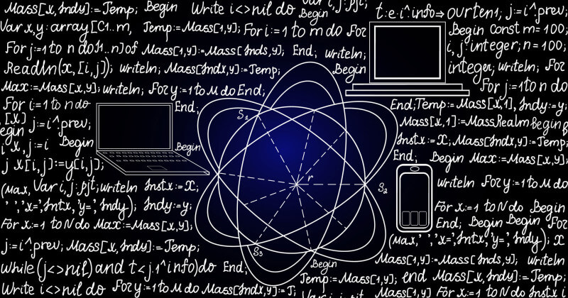

<!-- _backgroundColor: aquq -->

<!-- _color: darkgreen -->

<!-- paginate: false -->

## Algoritma ve Programlama

### Hafta-1 (Algoritmaya Giriş)

#### Bahar Dönemi, 2022-2023

İndir [DOC](week-1.tr.md_doc.pdf), [SLIDE](week-1.tr.md_slide.pdf), [PPTX](week-1.tr.md_slide.pptx)

<iframe width=700, height=500 frameBorder=0 src="../week-1.tr.md_slide.html"></iframe>

---

<!-- paginate: true -->

### Algoritmaya Giriş

- Algoritma Nedir?

---

## **Algoritma Nedir?**

---

### Algoritma

- **Algoritma'nın Tanımı**
  Algoritma, belli bir problemi çözmek veya belirli bir amaca ulaşmak için tasarlanan yol. Matematikte ve bilgisayar biliminde bir işi yapmak için tanımlanan, bir başlangıç durumundan başladığında, açıkça belirlenmiş bir son durumunda sonlanan, sonlu işlemler kümesidir. Genellikle bilgisayar programlamada kullanılır ve tüm programlama dillerinin temeli algoritmaya dayanır. Aynı zamanda algoritma tek bir problemi çözecek davranışın, temel işleri yapan komutların veya deyimlerin adım adım ortaya konulmasıdır ve bu adımların sıralamasına dikkat edilmelidir. Bir problem çözülürken algoritmik ve sezgisel (herustic) olmak üzere iki yaklaşım vardır. Algoritmik yaklaşımda da çözüm için olası yöntemlerden en uygun olan seçilir ve yapılması gerekenler adım adım ortaya konulur. Algoritmayı belirtmek için; metinsel olarak düz ifade ve akış diyagramı olmak üzere 2 yöntem kullanılır. Algoritmalar bir programlama dili vasıtasıyla bilgisayarlar tarafından işletilebilirler.

---

### Algoritma

- 

---

**YAPILACAKLAR** DAHA FAZLA ARAŞTIRMA YAPIN!

--- 

## Referanslar

- https://www.linkedin.com/in/samet-kara%C5%9F-585999251/

---

$Hafta-1-Sonu$
